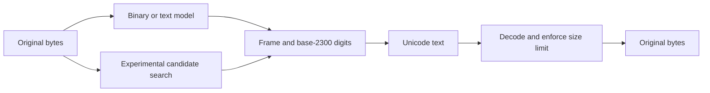

# Design: fewer code points, independently decodable

## Objective

Investigate how far exact data can fit into fewer Unicode code points when the
output alphabet has 2,300 symbols. Byte length, UTF-16 length, grapheme clusters,
display width and model tokens are separate measurements. Expansion is a valid
experimental result.

## Decisions

### Preserve portable formats

The alphabet, fixed-code model and block layouts come from the original
(unpublished) implementation. This extraction does not invent a replacement
encoding under the same name.
Checked v1 remains the default API. CRC-free and predictive candidates are an
explicit experimental import. This keeps the research accessible while making
the integrity tradeoff visible at the call site.

### Separate the local LLM mode

The original LLM codec depends on a daemon and a specific decoding profile.
Those are not dependencies of a portable string. Its `き` marker and corresponding
minimal header range remain reserved; decoding reports an unsupported format.
Reusing those slots would make old saved strings ambiguous. The independent
library neither sends data to an external service nor claims to reproduce the
original LLM result.

### Keep the original application intact

The standalone source is initially an extraction, with tests and provenance.
The original application continues to use its own implementation. A later
integration can replace those imports after package publication and
cross-project validation. That integration is a separate change; copying future
fixes between trees needs deliberate review until then.

### Treat native compression as capability-dependent

The experimental async API checks browser/runtime compression and decompression
support. Candidate selection can vary with the available codecs and their
implementations. Pure JavaScript candidates require no external model. A native
frame still needs a runtime with the matching decoder; senders must check the
receiver's capabilities when transferring those frames.

### Preserve byte identity

The byte API handles invalid UTF-8. Text modeling applies only to valid UTF-8
and preserves BOMs, NULs, combining marks and normalization forms. JavaScript
strings containing unpaired surrogates need explicit handling at the string API
boundary, since UTF-8 cannot encode surrogate code points.

### Bound resources and be honest about integrity

The existing 4 MiB limit on source and recovered byte arrays is retained.
Encoded strings have a separate length bound and may exceed 4 MiB in UTF-8.
Search still consumes CPU and intermediate memory; the demo uses a terminable
Worker and a smaller input cap. The simple wire format contains CRC32; minimal
frames omit it. Neither format authenticates a sender or conceals data.

## Future research

- Compare equal integrity budgets and the same compressed bytes across radices.
- Explore a separately versioned alphabet that tolerates normalization.
- Evaluate unseen, licensed multilingual corpora and report distributions.
- Specify an interoperable model manifest before revisiting LLM compression.
- Investigate streaming without changing the meaning of existing frames.

These are research directions, not promises of better compression.
