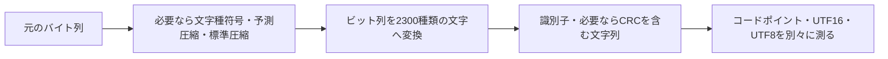

# Base2300 の有用性・実測・限界

調査日: 2026-09-15。目的は、**可逆性を保ちながら文字数を減らす実験**である。
中心となる評価単位は Unicode コードポイント数。通信量、保存容量、LLM のトークン数は別の量として扱う。

## 結論

Base2300 には、文字数とバイト数の違いを実装で探究する価値がある。
用途を具体的に絞るなら、**双方が同じ復号器を持ち、Unicode をそのまま保つ、コードポイント数で制限された自作の共有欄**が有望である。
2300 字という文字集合、固定の文字種符号、予測圧縮、標準圧縮を切り分けて比べられることも、このプロジェクトの特徴になる。

一方、Base64 より短いことは、元の文章より短いことを意味しない。
日本語の短文、絵文字、正規化、UTF-16 の文字数、URL 変換では期待が逆転する場合がある。
文字密度だけなら Base32768 や Base65536 という先行方式があるため、「世界最短」を主張する根拠もない。
価値を示すには、勝つ例と負ける例を同じ再現手順で公開するのがよい。

## 1. 「文字数」は一つではない

| 単位 | 何を数えるか | 例 |
| --- | --- | --- |
| Unicode コードポイント | Unicode の符号位置 | `𠮟` は 1 |
| UTF-16 コード単位 | JavaScript の `String.length` | `𠮟` は 2 |
| 書記素クラスタ | 利用者が一まとまりとして扱う文字の近似 | `e` + 結合アクセント、家族の絵文字は複数コードポイントでも一まとまり |
| UTF-8 バイト | ファイルや送信本文を UTF-8 にした量 | ASCII は 1 B、多くの漢字・かなは 3 B、`𠮟` は 4 B |
| サービス固有のカウント | サービスが定める重み付きの量 | 日本語と ASCII の重みが違う場合がある |

書記素の区切り方は Unicode のテキスト分割規則に基づく。今回の実測では Node の `Intl.Segmenter` と、その ICU/Unicode バージョンを記録した。画面上の幅や読みやすさを測る値ではない。[Unicode UAX #29](https://unicode.org/reports/tr29/)

Base2300 の文字表は、ASCII 64 字、UTF-8 で 3 B の 2235 字、4 B の `𠮟` の合計 2300 字。
したがって、出力コードポイント数と UTF-16 長を等しいと扱ってはいけない。
たとえば今回の疑似乱数 4096 B の portable 出力は **2959 コードポイント、2964 UTF-16 単位、8720 UTF-8 B** だった。
これはこのリポジトリの文字表と [実測結果](../bench/results.json) から確認できる。

## 2. 何を圧縮しているのか

処理を二段階に分けると理解しやすい。

バイナリを多くの種類の文字に置き換える段階は、表記の密度を上げる。
長い入力では Base64 の 1 字は 6 bit、2300 種の文字の理論上の情報量は `log2(2300) ≈ 11.1674 bit` である。
現行 v1 はブロックの長さを保存するため **244 bit を 22 字**に格納するので、完全なブロックの実効密度は約 **11.0909 bit/字**。
識別子・CRC32・最後のブロックの費用は別に必要になる。
Base64 の定義は [RFC 4648](https://www.rfc-editor.org/rfc/rfc4648.html)、Base2300 の値は [実装](../src/base2300.ts) による。

これは、同じバイト列を Base64 にした場合に比べ、長い入力の文字数を約 46% 減らせる計算になる。
ただし、Base2300 の出力は主に UTF-8 で 3 B の文字を使う。
バイナリを直接表記する場合、UTF-8 サイズは元データの約 2 倍強になる例がある。

文字種符号や圧縮器は、その前段のビット数を減らす。
現行 portable の固定文字種符号では、多くの日本語の文字に 13 bit を使うため、**元の日本語 1 字を常に 1 字未満にできる仕組みではない**。
experimental の日本語向け符号、反復や予測の利用によって、さらに短くなる入力がある。
任意の入力をすべて短くする保証はない。入力の集合全体を、それより少ない出力の集合へ一対一に対応させることはできないためである。

## 3. 実際のサイズ比較

以下は synthetic corpus の一部。表の各セルは **コードポイント数 / UTF-8 バイト数**。
すべて識別子・ヘッダー・CRC・パディングなど、その方式の完全な出力を数えている。
全文字種、全方式、UTF-16、書記素、JSON/URL、速度、原データの SHA-256 は [生成された比較表](benchmarks.md) と [JSON](../bench/results.json) を参照。

| 入力 | 元の文字数 / 元の B | Base64 | gzip + Base64 | Brotli + Base64 | Base2300 portable CRC | Base2300 advanced + native |
| --- | --- | --- | --- | --- | --- | --- |
| 英語の挨拶 | 13 / 13 | 20 / 20 | 44 / 44 | 24 / 24 | 13 / 37 | 10 / 28 |
| `こんにちは、世界。` | 9 / 27 | 36 / 36 | 68 / 68 | 44 / 44 | 15 / 41 | 10 / 26 |
| 日本語の説明文 | 46 / 138 | 184 / 184 | 180 / 180 | 144 / 144 | 58 / 174 | 43 / 123 |
| 英語の説明文 | 117 / 117 | 156 / 156 | 148 / 148 | 108 / 108 | 77 / 227 | 54 / 152 |
| 絵文字の組合せ | 22 / 80 | 108 / 108 | 120 / 120 | 100 / 100 | 62 / 186 | 37 / 107 |
| JSON レコード | 630 / 678 | 904 / 904 | 248 / 248 | 204 / 204 | 474 / 1384 | 105 / 309 |
| 同じ日本語の反復 | 1792 / 5376 | 7168 / 7168 | 104 / 104 | 56 / 56 | 2105 / 6205 | 30 / 86 |
| 32 B のバイナリ | — / 32 | 44 / 44 | 76 / 76 | 48 / 48 | 28 / 80 | 25 / 73 |
| 疑似乱数 4096 B | — / 4096 | 5464 / 5464 | 5492 / 5492 | 5468 / 5468 | 2959 / 8720 | 2956 / 8723 |

### この表から分かること

- **文字数とバイト数の交換が実測できる。** 疑似乱数の場合、portable は Base64 より文字数が 45.8% 少ない一方、UTF-8 バイト数は 59.6% 多い。元のバイナリに比べると 112.9% 増である。
- **日本語も常に短くなるわけではない。** 46 字の説明文は advanced で 43 字になったが、9 字の挨拶は 10 字。portable はそれぞれ 58 字、15 字だった。
- **絵文字は元から多くの情報を少ないコードポイントに置ける。** 今回の 22 コードポイント・8 書記素の列は、advanced で 37 コードポイントになった。
- **入力が圧縮できればバイト数も減る場合がある。** 反復する日本語は 5376 B から advanced の 86 B になった。ただし、この例では Brotli + Base64 の 56 B の方が小さい。
- **Base2300 内で最少文字数を選ぶことは、最少バイト数を選ぶことではない。** 疑似乱数の CRC あり出力は 8720 B、CRC なしの短い出力は 8723 B。桁の配置で ASCII/CJK の比率が変わるため、この小さな逆転も起きる。

### 公平な読み方

portable は CRC32 あり、今回選ばれた advanced は CRC32 なしである。
短文での数文字の差には、CRC を省いた効果が含まれる。
比較表には **単純バイナリ + CRC、単純バイナリ minimal、Base64 + 同じ 4 B の CRC** も載せた。
Base64 + CRC の行は比較専用の包み方で、Base64 自体の標準機能ではない。

gzip はレベル 9、Brotli は quality 5、generic mode、lgwin 22 を使用した。
native 候補は `CompressionStream` の既定設定であり、品質パラメータは公開 API から指定できない。
その違いを隠さないため、**同じ `CompressionStream` に元のバイト列を渡し、Base64 にした行**も用意した。
advanced が `brotli-0` / `deflate-raw-0` を選んだ場合は、これらが同じ圧縮器・設定・入力に対応する比較対象になる。
ただし Base2300 には方式と前処理を表すフレームがあり、Base64 行では方式を表の外から知っている、という違いが残る。[Node zlib API](https://nodejs.org/download/release/v22.21.1/docs/api/zlib.html)、[Compression Standard](https://compression.spec.whatwg.org/)

今回の測定は Node 22.21.1 / Apple M2 Pro、20 個の固定入力、各方式 1 回のウォームアップと 3 回の計測。
全実行で元バイト列との完全一致を検査している。
入力は公開可能な短い自作例と固定 seed の疑似乱数で、言語全体の性能を代表するコーパスではない。
速度は同梱 JSON に各測定値と中央値を保存した。起動時間・文字表初期化・最大メモリは測定していない。

## 4. 先行方式と現在の位置づけ

まず密度の違いを整理する。以下は、長い無圧縮バイナリを表記した場合の仕様上の値であり、個別の入力を測った値ではない。

| 方式 | 主な密度 | 主な利点 | Base2300 との比較 |
| --- | --- | --- | --- |
| Base64 / Base64url | 6 bit/コードポイント | ASCII、標準化、UTF-8 で扱いやすい | 文字数は多いが、相互運用とバイト数で有利になりやすい |
| Base2048 | 11 bit/コードポイント | 軽い重みで数えられる文字集合を狙った設計 | Base2300 の無圧縮密度に近い。文字集合の目的が違う |
| Base2300 v1 binary | 完全ブロックで約 11.09 bit/コードポイント | 2300 字の固定表、版識別子、CRC、かな・常用漢字主体 | 字種の選択と前処理を探究する対象になる |
| Base32768 | 15 bit/コードポイント、全字 BMP | UTF-16 の 1 単位に高い密度で格納 | 無圧縮バイナリの文字密度は Base2300 より高い |
| Base65536 | 約 16 bit/コードポイント | より少ないコードポイントで表記 | 補助平面を使い、UTF-16 の長さとの違いが大きい |

Base64 と URL 向けの文字表は [RFC 4648](https://www.rfc-editor.org/rfc/rfc4648.html) に定義される。
Base2048、Base32768、Base65536 の目的・密度・文字集合は、それぞれの一次実装の README による。
いずれも圧縮器と組み合わせられるため、Base2300 だけに圧縮をかけた結果を、他方式の無圧縮の結果と比べて「基数として優れる」と結論してはいけない。[Base2048](https://github.com/qntm/base2048)、[Base32768](https://github.com/qntm/base32768)、[Base65536](https://github.com/qntm/base65536)

### 同じバイト列を使った外部実装の実測

npm registry への名前解決はできなかったが、Base2048 / Base32768 は Web 経由で一次実装のソースを取得できた。
MIT ライセンスを添えて [ベンチ用のソーススナップショット](../bench/vendor/README.md) として収録し、SHA-256、README の既知の入出力例、全サンプルの往復を検証した。
アルゴリズムや文字表を模作した実装ではない。
取得ビューによる空行の違いがあり、npm の特定リリースとバイト単位で同一とは主張しない。上流 commit は独立確認できなかったため、同梱ソースのハッシュで固定している。

次の表は**前処理なし**。文字数 / UTF-8 B を示す。CRC なしの条件をそろえるため、Base2300 は binary minimal を使うが、その版ヘッダーは含める。

| 入力 | Base64 | Base2048 | Base2300 binary minimal | Base32768 |
| --- | --- | --- | --- | --- |
| 32 B バイナリ | 44 / 44 | 24 / 58 | 25 / 73 | 18 / 53 |
| 日本語短文の UTF-8 27 B | 36 / 36 | 20 / 49 | 21 / 59 | 15 / 44 |
| 疑似乱数 4096 B | 5464 / 5464 | 2979 / 7380 | 2956 / 8723 | 2185 / 6541 |

この入力では、Base32768 は Base2300 より少ない文字数と UTF-8 バイト数で表記できた。
Base2300 の文字表を選ぶ価値は、日本語主体という制約や表現を探究したいかどうかにも依存する。
また、Base2048 の疑似乱数出力は 2979 コードポイントに対して 2976 書記素だった。文字集合を変えたときも、書記素数をコードポイント数から推定せず測定する必要がある。

Base65536 は今回未計測。インストールできる環境では [再実行手順](benchmarks.md#reproduce) で実際のパッケージを自動検出し、比較に加えられる。推定値を実測表には補っていない。

### SNS の文字制限は実装ごとに異なる

調査時点の X の公式説明では、CJK 文字は重み 2、一般的な Latin 文字は重み 1 で数える。
したがって、Base2300 のコードポイント数が Base64 の約半分になっても、そのまま同じ割合で投稿枠を節約できるわけではない。
「X で使える最大バイト数」は本ベンチからは算出していない。[X: Counting Characters](https://docs.x.com/fundamentals/counting-characters)

## 5. デメリットと失敗しやすい条件

### UTF-8、JSON、URL の費用

出力を Unicode のまま JSON に入れるなら、周囲の引用符など以外は UTF-8 の費用になる。
非 ASCII を `\uXXXX` に逃がすシリアライザでは、多くの出力文字が 6 ASCII B、`𠮟` はサロゲートペアで 12 B になる。
URL コンポーネントでは、非 ASCII の UTF-8 の各バイトが `%XX` に展開される。[WHATWG URL Standard](https://url.spec.whatwg.org/#percent-encoded-bytes)

疑似乱数 4096 B の portable 出力を実測すると、次のようになる。

| 表現 | バイト数 |
| --- | --- |
| 元のバイナリ | 4096 |
| Base64url、padding なし | 5462 |
| Base2300 の UTF-8 | 8720 |
| Base2300 の ASCII escape JSON 文字列、引用符込み | 17381 |
| Base2300 の `encodeURIComponent` 結果 | 26008 |

この結果から、URL を短くする用途、UTF-8 転送量の削減、保存容量だけを目的とする用途には利点を主張できない。
QR コードの大きさも、コードポイント数では決まらないため、ここでは優位性を主張しない。

### Unicode 正規化と文字の置換

現行アルファベットを全件調べると、NFC/NFKC では変化せず、NFD/NFKD では **`ゔ` → `う` + 結合濁点、`ヴ` → `ウ` + 結合濁点** の 2 字が変わった。
変換後の列は元のワイヤ形式と同一ではない。
見た目が同じでも、別字への置換、異体字の統一、かな変換、OCR、手入力による転記で壊れる可能性がある。
この形式は入力を勝手に正規化しない。文字表を修正して改善する場合は、既存データを守るために形式の版を変える必要がある。[Unicode UAX #15](https://unicode.org/reports/tr15/)、[アルファベット実測](benchmarks.md#alphabet-and-normalization-audit)

### 復号器・計算量・完全性

- 受け手に復号器が必要。出力には通常の文章としての意味がなく、手で読むことを目的としない。
- 固定文字表・ブロック処理・BigInt・圧縮候補の探索は、一般的な Base64 より実装と計算の費用が大きい。本ベンチで advanced の時間には候補探索全体を含めている。
- native 方式は受信側にも同じ圧縮形式の復元機能が必要。今回の Node では Brotli/raw DEFLATE とも往復できたが、すべてのブラウザを実測した結果ではない。
- experimental minimal は CRC を省く。形式として読めても、別の元データへ変わったことを検出できない場合がある。CRC ありでも CRC32 は暗号学的な認証ではない。
- 暗号化機能はない。高い基数で見慣れない文字に変えても、秘密にはならない。
- 任意の Unicode を扱う既存システムでも、UTF-16 長、バイト長、正規化、許可文字、データベース照合規則の条件は別々に確認する必要がある。

## 6. 活用事例の提案

ここからは実装・実測・標準の性質に基づく提案であり、既存の採用実績を示すものではない。

| 案 | Base2300 を使う理由 | 成立する条件・測りたいこと |
| --- | --- | --- |
| 自作ゲームのリプレイや共有コード | バイナリの状態・操作列を、少ないコードポイントのコピー用文字列にする | アプリが双方に復号器を持つ。文字が変化しない。元のバイト数と制限の単位も表示する |
| 自作ツールの設定スナップショット | 小さな JSON や構造化バイナリを、文字数の上限がある共有欄に貼る | 標準圧縮 + Base64url と同じ入力で比較。認証や署名が必要なら、その分も数える |
| Unicode と情報表現の教材 | 同じ情報が「短い文字列・大きいファイル」になることを体験する | 入力、符号列、コードポイント、UTF-16、書記素、UTF-8、JSON/URL を並べる |
| コピー経路の互換性テスト | 補助平面、かなの分解、全角/半角など、文字を変える経路を発見する | 送受信バイトの一致を検査し、サービスや OS ごとの結果を記録する |
| パズル・コードアート | 常用漢字・かな主体の文字集合そのものを楽しむ | 読める文章や暗号として誤解させない。手入力を必須にしない |
| 基数・文字種モデルの比較実験 | 2300 字に制約した場合の密度と前処理の効果を分析する | 同じ圧縮バイトを Base64/2048/2300/32768/65536 へ渡し、制限単位別に評価する |

最初の実用試作には、**短いバイナリや設定の共有コード**が適している。
たとえば今回の 32 B のバイナリは、CRC ありで 28 コードポイント・80 B になった。
「28 文字として枠に収まること」と「80 B を保存すること」を両方許容できるアプリなら、採用理由が明確になる。
それでも最大密度が目的なら、より大きな文字集合の方式も同時に比較する。

## 7. 今後の探究課題

1. **同じ前処理・同じ完全性条件での基数比較。** 今回の無圧縮 Base2048/Base32768 比較を、圧縮済みの同一バイト列や Base65536 へ広げる。
2. **文字集合の設計。** 日本語らしい字種、正規化不変性、BMP 限定、フォント互換性、UTF-8 費用をトレードオフとして測る。変更は新しい版で行う。
3. **選択規則を制限単位に合わせる。** 現状はコードポイント数。UTF-16 や特定サービスの重みを使う場合は、別の評価関数を明示する。
4. **再現可能な互換性の記録。** ブラウザ/OS/コピー経路、短文の壊れ方、復号拒否、メモリ上限を記録する。
5. **コーパスの拡充。** ライセンスの明確な実データを、言語・文体・長さ別に追加する。平均だけでなく、小さい入力での失敗例を残す。

LLM のトークン削減や、モデルなしでの意味理解の維持は、本調査の成果として扱わない。
それらを調べる場合は、トークナイザ・モデル・プロファイル・復号条件を固定した独立の実験が必要になる。
